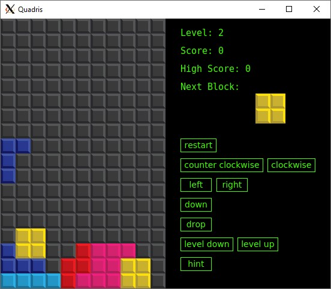
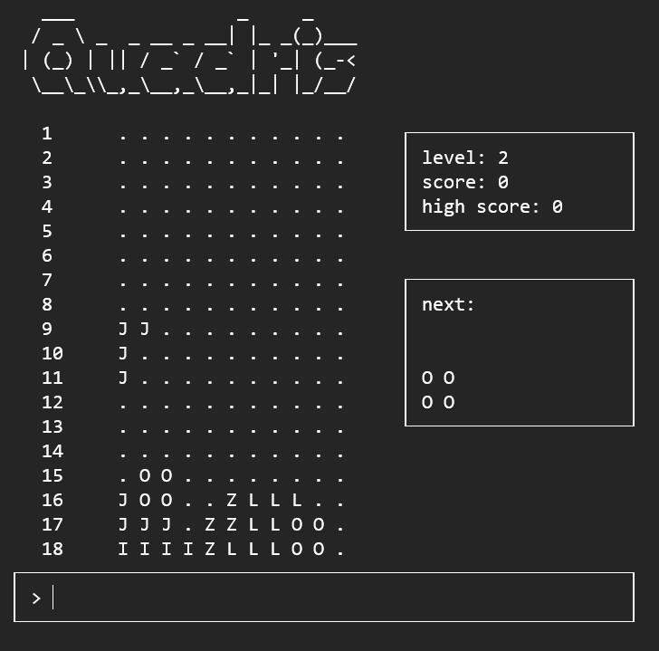

# quadris
C++ implementation of a modified Tetris game.
# How to Use
To build the project run `qmake && make`, or run `build.sh`. The makefile will create the executable file `quadris`. To run the application, run `./quadris`.
# Implementation
The implementation makes use of multithreading with mutex locks, smart pointers, and is built in the Qt Framework.
# Design Patterns
This project makes use of the folllwing design patterns:
- Adapter
- Strategy
- MVC
- Observer
- Iterator
- Facade
- Factory
- Decorator
# Screenshots
### User Interface

### Console View

